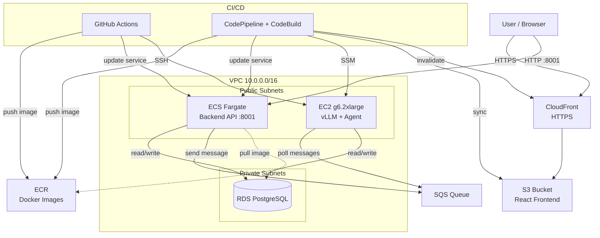

# Infrastructure Architecture

```mermaid
graph TB
    User[User / Browser]
    CF[CloudFront<br/>HTTPS]
    S3[S3 Bucket<br/>React Frontend]

    User -->|HTTPS| CF
    CF --> S3

    User -->|HTTP :8001| ECS

    subgraph VPC["VPC 10.0.0.0/16"]
        subgraph Public["Public Subnets"]
            ECS[ECS Fargate<br/>Backend API :8001]
            EC2[EC2 g6.2xlarge<br/>vLLM + Agent]
        end
        subgraph Private["Private Subnets"]
            RDS[(RDS PostgreSQL)]
        end
    end

    SQS[SQS Queue]
    ECR[ECR<br/>Docker Images]

    ECS -->|read/write| RDS
    ECS -->|send message| SQS
    EC2 -->|poll messages| SQS
    EC2 -->|read/write| RDS
    ECS -.->|pull image| ECR

    subgraph CICD["CI/CD"]
        GHA[GitHub Actions]
        CP[CodePipeline + CodeBuild]
    end

    GHA -->|push image| ECR
    GHA -->|update service| ECS
    GHA -->|SSH| EC2
    CP -->|push image| ECR
    CP -->|update service| ECS
    CP -->|SSM| EC2
    CP -->|sync| S3
    CP -->|invalidate| CF
```
